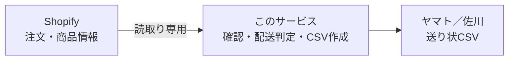
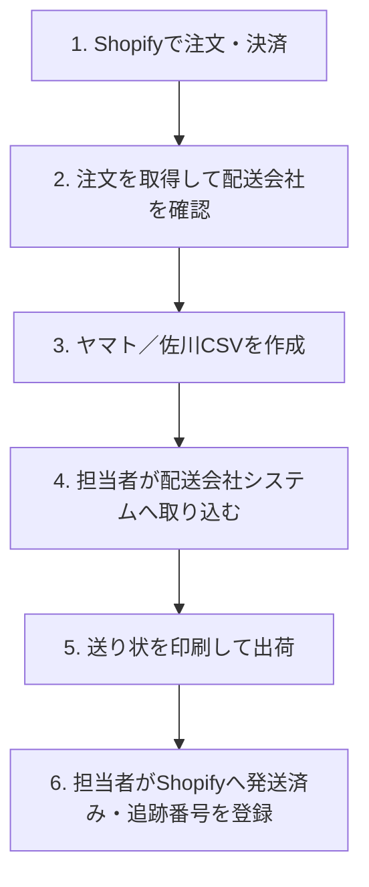

# ワコウ送り状CSV変換

Shopifyの注文から、株式会社ワコウ指定形式のヤマト／佐川送り状CSVを作成する社内向けWebサービスです。

## これは何をするサービスなの？

### サービス説明

Shopifyから「決済済み・未発送・未キャンセル」の注文を読み取り、商品の配送設定と数量から配送会社を判定して、送り状CSVを作成します。



このサービスが担当するのはCSV作成までです。次の処理は行いません。

- 配送会社システムへの取込み
- 送り状印刷と実際の出荷
- 追跡番号の取得
- Shopifyの発送済み処理と追跡番号登録

Shopifyへの権限は`read_orders`と`read_products`だけです。CSVをダウンロードしても、Shopifyの注文ステータスは変わりません。

### 導入方法（クイックスタート）

本番ではMac miniでサービスを動かし、担当者PCはブラウザだけを使用します。

```bash
mkdir -p "$HOME/Services"
cd "$HOME/Services"
git clone https://github.com/UNLegume/csv_transfer_for_wakou.git
cd csv_transfer_for_wakou
uv sync --extra dev

uv run wakou-macos-profile prepare \
  --profile production \
  --app-dir "$PWD" \
  --port 8100
```

作成された次のファイルに、Shopify接続情報とログイン情報を設定します。

```text
~/Library/Application Support/WakouCSV/profiles/production/.env
```

設定後に起動します。

```bash
uv run wakou-macos-profile validate --profile production
uv run wakou-macos-profile install --profile production
uv run wakou-macos-profile status --profile production
```

秘密値はREADME、Git、チャットへ記載しないでください。Mac miniの詳しい導入、Tailscale HTTPS、更新、バックアップは[`docs/mac-mini-profile-deployment.md`](docs/mac-mini-profile-deployment.md)、Shopifyの商品設定は[`docs/shopify-setup.md`](docs/shopify-setup.md)を参照してください。

## どうやって使うの？

### 出荷自体の全体のフロー



### どの部分のフローをこのサービスが賄っているか

| 作業 | 担当 |
|---|---|
| Shopify注文の取得 | このサービス |
| 配送会社の自動判定 | このサービス |
| 配送会社の最終確認 | 人間 |
| 住所・電話番号などの検証 | このサービス |
| ヤマト／佐川CSVの作成 | このサービス |
| CSVの配送会社システムへの取込み | 人間 |
| 送り状印刷・梱包・出荷 | 人間 |
| Shopifyの発送済み処理・追跡番号登録 | 人間 |

### 具体的な利用方法

1. 案内されたURLをブラウザで開き、ユーザー名とパスワードでログインします。
2. `注文日（開始）`、`注文日（終了）`、`出荷予定日`を入力します。
3. `Shopifyから注文取得`を押します。
4. `自動判定`、`出力先`、`検証状態`を確認します。
   - 配送会社が未設定なら、ヤマトまたは佐川を選択します。
   - 自動判定から変更しても理由入力は不要です。
   - 住所などのエラーはShopify側で修正して再取得します。
5. 出力する注文を選択します。
6. `ヤマトCSVをダウンロード`または`佐川CSVをダウンロード`を押します。
7. ダウンロードしたCSVを配送会社のシステムへ取り込みます。

CSVが生成されて履歴に記録された時点で、その注文は`出力済み`になります。ブラウザへの保存に失敗した場合は、通常出力を繰り返さず、次の手順で再出力します。

1. 対象注文を含む期間の注文を再取得します。
2. `出力済み一覧`を開きます。
3. 注文を検索し、再出力理由を入力します。
4. `再出力`を押します。

通常の配送会社指定・変更は理由不要ですが、再出力理由は必須です。

### 機能早見表

| 機能 | 内容 |
|---|---|
| 注文取得 | 決済済み・未発送・未キャンセル注文を期間指定で取得 |
| 配送会社判定 | 商品設定と数量からヤマト／佐川を判定 |
| 手動変更 | 担当者が配送会社を変更可能。理由入力不要 |
| 宛先検証 | 氏名、住所、郵便番号、電話番号、文字を確認 |
| CSV出力 | ヤマト42列、佐川50列で出力 |
| 出力履歴 | 出力済み注文を記録し、重複出力を防止 |
| 再出力 | 理由を記録して出力済み注文を再生成 |
| Shopify更新 | 対応しない。出荷後に人間が実施 |
| 配送会社への送信 | 対応しない。人間がCSVを取り込む |

## シートにどういう情報が載っているの？

ダウンロードされるファイルはCSVです。先頭行が項目名で、2行目以降は1注文につき1行です。

| 共通仕様 | 内容 |
|---|---|
| 文字コード | CP932 |
| 改行 | CRLF |
| 列数 | ヤマト42列、佐川50列 |
| 個人情報 | 届け先氏名、住所、郵便番号、電話番号を含む |
| 商品明細 | Shopifyの商品名やSKUの一覧は出力しない |

発送元・依頼主・請求コードなどの列は、ワコウ指定の列位置を保ったまま空欄で出力します。このサービスへの登録は不要です。

### ヤマト

| 情報 | 内容 |
|---|---|
| 注文番号 | Shopify注文番号 |
| 送り状種別 | ヤマト設定値 |
| 出荷予定日 | 画面で指定した日付 |
| 届け先 | 氏名、電話番号、郵便番号、住所、建物名 |
| 品名 | 固定設定値。標準は「ネットショップ購入品」 |
| 代引き | 代金引換額、消費税額の設定値 |
| 空欄項目 | 発送元、依頼主コード、請求情報、配達指定、時間指定、会社名、カナ、荷扱い、営業所止めなど |

Shopifyの商品名やSKUはヤマトCSVへ出力せず、品名には固定設定値を使用します。

### 佐川

| 情報 | 内容 |
|---|---|
| 注文番号 | Shopify注文番号 |
| 日付・便種 | 画面で指定した日付と佐川設定値 |
| 受注者 | Shopify請求先。請求先がなければ配送先 |
| 届け先 | 氏名、電話番号、郵便番号、住所 |
| 指示文言 | 佐川設定の`option1`〜`option6` |
| 支払い設定 | 郵便種別、元／着払い種別、代引き種別 |
| 空欄項目 | 発送元、依頼主、請求コード、時間指定、シールコード、営業所止め、備考、品名など |

Shopifyの商品名やSKUは佐川CSVの品名欄へ出力せず、現在は空欄です。

CSVには個人情報が含まれます。許可されていないメールやチャットへ添付せず、不要になったファイルは社内ルールに従って削除してください。
