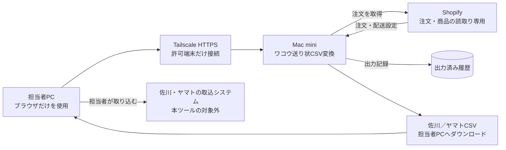
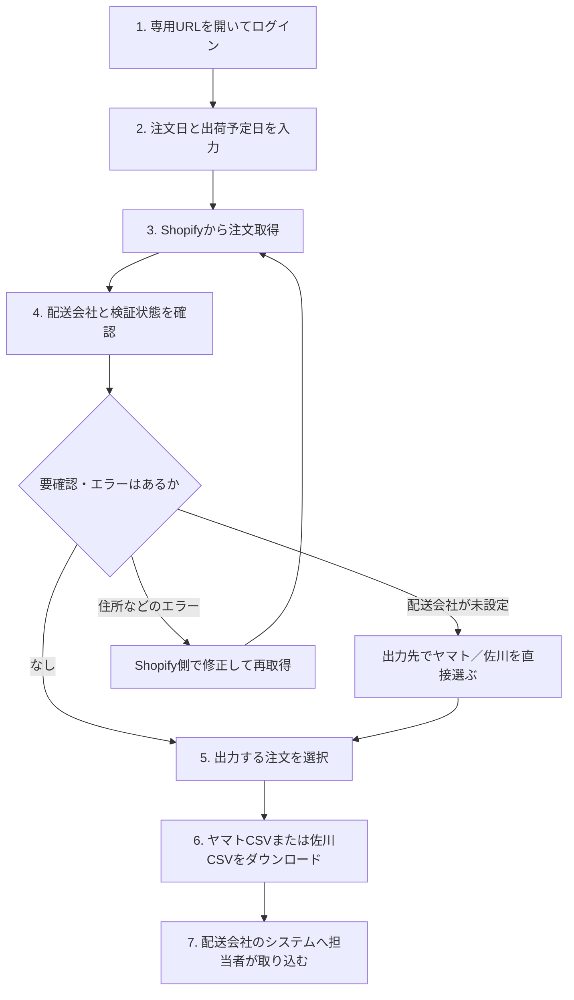
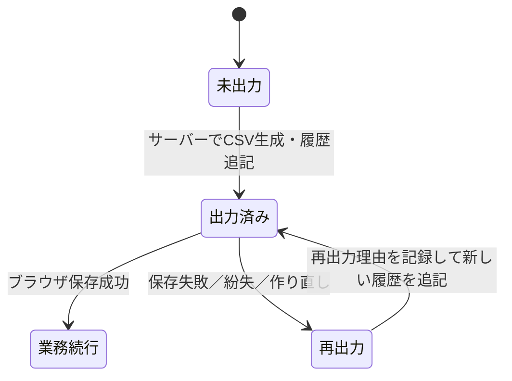

# csv_transfer_for_wakou

Shopify Admin GraphQL APIから注文を読み取り、株式会社ワコウ指定形式の佐川・ヤマト（ネコポス）送り状CSVを生成する社内向けWebツールです。

## 対象範囲

- Shopifyから決済済み・未発送・未キャンセル注文を読み取る
- 商品／バリエーションのメタフィールドから配送会社を判定する
- 注文単位で佐川／ヤマトへ集約する
- 宛先、郵便番号、電話番号、文字数、CP932互換性を検証する
- ワコウ指定の佐川50列、ヤマト42列CSVをCP932・CRLFで生成する
- 注文ID、注文番号、配送会社、生成日時だけを履歴保存して重複出力を防ぐ

配送会社への直接送信、送り状印刷、発送処理、追跡番号取得、Shopifyへの発送実績反映は対象外です。

## 実運用前の重要事項

`.env.example` の送り状固定値は提供されたサンプルの値です。請求コード、依頼主コード、便種、代引き種別、オプション文言、請求先分類コード、運賃管理番号などは、株式会社ワコウの正式回答を得てから本番値に設定してください。未確認のまま本番出荷には使用しないでください。

## 利用方法（担当者向け）

日常業務では、担当者PCへのアプリのインストールやターミナル操作は不要です。Mac miniが起動していることを確認し、許可されたPCのブラウザから管理者に案内されたTailscale HTTPS URLを開きます。

### 全体のしくみ



- Shopifyの秘密情報と出力履歴はMac miniだけに保存します。
- 担当者PCにはブラウザからダウンロードしたCSVだけが残ります。
- 本ツールからShopify、佐川、ヤマトへ注文や発送実績を書き込むことはありません。

### 通常のCSV出力



1. 管理者から案内されたHTTPS URLをブラウザで開き、案内されたユーザー名とパスワードでログインします。
2. `注文日（開始）`、`注文日（終了）`、`出荷予定日`を入力します。
3. `Shopifyから注文取得`を押します。
4. 一覧の`自動判定`、`出力先`、`検証状態`を確認します。
   - `要確認`で配送会社が未設定なら、`出力先`でヤマトまたは佐川を直接選択します。
   - 自動判定と異なる配送会社へ変更しても構いません。指定・変更理由は不要です。
   - 住所などの検証エラーはShopify側で修正し、注文をもう一度取得します。
5. チェックボックスで注文を選択します。`ヤマト候補を選択`、`佐川候補を選択`も利用できます。
6. `ヤマトCSVをダウンロード`または`佐川CSVをダウンロード`を押します。
   - ヤマトと佐川を混在選択できます。各ボタンには、その配送会社として出力できる選択件数が表示されます。
   - 一方を出力した後も、もう一方の未出力選択は維持されます。続けてもう一方をダウンロードしてください。
7. ダウンロードしたCSVを、担当者が佐川またはヤマトのシステムへ取り込みます。

### 画面の見方

```text
┌──────────────────────────────────────────────────────────────┐
│ 注文日（開始）  注文日（終了）  出荷予定日  [Shopifyから注文取得] │
├──────────────────────────────────────────────────────────────┤
│ 対象注文       ヤマト候補       佐川候補       要確認・エラー     │
├──────────────────────────────────────────────────────────────┤
│ [未出力の注文] [出力済み一覧]                                  │
├──────────────────────────────────────────────────────────────┤
│ [ヤマト候補を選択] [佐川候補を選択] [選択解除]   〇件選択        │
│                         [ヤマトCSV] [佐川CSV]                  │
├──────────────────────────────────────────────────────────────┤
│ □ 注文番号 │ 配送先 │ 商品 │ 自動判定 │ 出力先 │ 検証状態       │
└──────────────────────────────────────────────────────────────┘
```

| 表示 | 確認すること |
|---|---|
| `対象注文` | 指定期間から取得した未出力注文数 |
| `ヤマト候補`／`佐川候補` | 自動判定された配送会社別の件数 |
| `要確認・エラー` | 配送会社の指定またはShopify側での修正が必要な件数 |
| `自動判定` | 商品メタフィールドと数量から判定した候補 |
| `出力先` | 実際にCSVへ出力する配送会社。担当者が変更可能 |
| `検証状態` | 住所、電話番号、文字数、文字コードなどの確認結果 |

### 出力済みになるタイミング



CSVがMac mini上で生成され、出力履歴へ記録された時点で`出力済み`になります。ブラウザがファイルを保存できなかった場合も出力済みとして扱われるため、同じ注文を通常出力し直さないでください。

### ダウンロードに失敗した場合・再出力する場合

1. 対象注文を含む注文期間を指定し、`Shopifyから注文取得`を押します。
2. `出力済み一覧`タブを開きます。
3. 注文番号で検索するか、`さらに表示`で対象注文を探します。
4. 再出力先を確認し、`再出力理由（必須）`を入力します。
5. `再出力`を押して、生成されたCSVを保存します。

再出力では以前の履歴を変更せず、新しい履歴を追記します。配送会社の初回指定・通常変更には理由は不要ですが、再出力理由だけは重複取込み防止のため必須です。

### 担当者がしてはいけないこと

- Mac miniの設定ファイル、出力履歴データ、動作記録を担当者PCへコピーしない
- CSVをメールや許可されていないチャットへ添付しない
- ダウンロードしたCSVを共有PCへ放置しない
- 出力済み注文を、履歴を確認せず通常出力し直さない
- 住所エラーをCSV上で場当たり的に修正せず、Shopifyの正本を修正して再取得する

## 必要環境

- Python 3.12以上
- [uv](https://docs.astral.sh/uv/)
- Shopifyカスタムアプリ

Shopifyカスタムアプリに必要な基本スコープは次のとおりです。

- `read_orders`
- `read_products`

60日より古い注文を取得する場合はShopifyによる `read_all_orders` の追加承認が必要です。本ツールはShopifyへ書き込みません。

## セットアップ

```bash
git clone https://github.com/UNLegume/csv_transfer_for_wakou.git
cd csv_transfer_for_wakou
uv sync --extra dev
cp .env.example .env
```

`.env` にShopify接続情報、発送元、ワコウ指定の固定値を設定します。アプリは起動時に
`.env`を自動読込みします。`.env` はGit管理されません。

操作画面とCSV出力APIはHTTP Basic認証で保護されます。`WAKOU_AUTH_USERNAME`と`WAKOU_AUTH_PASSWORD`には推測されにくい値を設定してください。

```env
SHOPIFY_STORE_DOMAIN=your-store.myshopify.com
SHOPIFY_CLIENT_ID=...
SHOPIFY_CLIENT_SECRET=...
SHOPIFY_API_VERSION=2026-07
```

2026年以降に新規作成する自社ストア向けアプリはShopify Dev Dashboardで作成し、Client Credentials Grantを使用します。アプリはClient ID／Secretから24時間有効なアクセストークンを注文取得時に自動発行するため、短期トークンを手作業で更新する必要はありません。

その他の設定項目は `.env.example` を参照してください。

## 商品の配送会社設定

Shopifyの商品またはバリエーションに次のメタフィールドを登録します。バリエーション側の値が商品側より優先されます。

| namespace | key | 型 | 値 |
|---|---|---|---|
| `delivery` | `carrier` | 1行のテキスト | `yamato` または `sagawa` |
| `delivery` | `yamato_max_quantity` | 整数 | 任意。ネコポスで出荷できる商品単位の最大数量 |

判定ルール：

1. 配送会社未設定の商品を含む注文は「要確認」
2. 佐川商品を1点でも含む注文は佐川
3. ヤマト商品のみでも商品別または全体数量上限を超えた場合は佐川
4. それ以外はヤマト
5. 画面では自動判定にかかわらず、理由入力なしで最終的な配送会社を指定可能

詳しい設定手順は `docs/shopify-setup.md` を参照してください。

## 起動

```bash
uv run uvicorn wakou_transfer.app:create_app --factory --host 127.0.0.1 --port 8000 --workers 1
```

プレビューはプロセス内メモリで管理するため、実運用でも必ず単一worker
（`--workers 1`）で起動してください。複数workerでは、プレビューを作成したworkerと
CSV出力を受けるworkerが異なり、注文を参照できない場合があります。

ブラウザで `http://127.0.0.1:8000` を開きます。

### Mac miniで他サービスと分離して常駐させる

既存のmacOSログインユーザー内に、アプリ専用の実行プロファイル、ポート、ログ、
SQLite履歴、LaunchAgentを作成できます。ソースコードと秘密情報・実行データを分離するため、
同じMac miniで他サービスが動いていてもパスやlaunchdラベルが衝突しません。

```bash
uv run wakou-macos-profile prepare \
  --profile production \
  --app-dir "$PWD" \
  --port 8100
```

生成されたプロファイルの`.env`を人間が設定した後、検証・常駐登録します。

```bash
uv run wakou-macos-profile validate --profile production
uv run wakou-macos-profile install --profile production
uv run wakou-macos-profile status --profile production
```

Mac miniへの導入、Tailscale HTTPS、更新、バックアップ、AI作業時の停止点を含む完全な手順は
[`docs/mac-mini-profile-deployment.md`](docs/mac-mini-profile-deployment.md)を参照してください。

## テスト

初回だけPlaywrightのテスト用Chromiumをインストールします。

```bash
uv sync --extra dev
uv run playwright install chromium
```

その後は、API・CSV・画面状態遷移をまとめて検証できます。

```bash
uv run pytest
uv run ruff check .
uv run mypy src tests
```

テストはShopify GraphQL、配送判定、宛先検証、CSV列契約、Web API、複数選択、
出力後の状態保持、履歴からの再出力、二重送信防止を対象にしています。

## CSV仕様

| 項目 | 佐川 | ヤマト／ネコポス |
|---|---:|---:|
| 列数 | 50 | 42 |
| 文字コード | CP932 | CP932 |
| 改行 | CRLF | CRLF |
| 見出し | あり | あり |
| 行単位 | 1注文1行 | 1注文1行 |

電話番号、郵便番号、請求コード、依頼主コードなどは文字列として扱い、先頭ゼロを保持します。

## セキュリティとデータ保持

- Shopifyトークンは環境変数で管理し、リポジトリやログへ出力しない
- APIは読取専用スコープだけを使用する
- プレビュー中の注文情報はプロセス内メモリだけに保持する
- SQLite履歴には氏名、住所、電話番号を保存しない
- 履歴APIはプレビューとの対応付けに使う注文IDを含むが、氏名、住所、郵便番号、電話番号、商品明細を返さない
- CSV自体には個人情報が含まれるため、安全な場所へ保存して不要になったら削除する

## 構成

- `src/wakou_transfer/shopify.py` — Shopify GraphQL読取クライアント
- `src/wakou_transfer/routing.py` — 注文単位の配送会社判定
- `src/wakou_transfer/validation.py` — 宛先の正規化・検証
- `src/wakou_transfer/csv_export.py` — 佐川・ヤマトCSV生成
- `src/wakou_transfer/history.py` — 個人情報を持たない出力履歴
- `src/wakou_transfer/app.py` — Web画面とAPI
