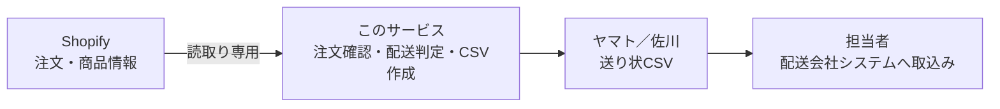
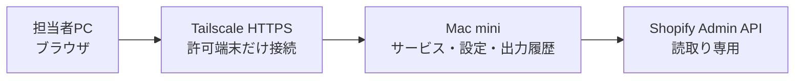
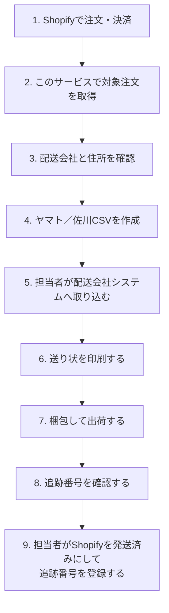
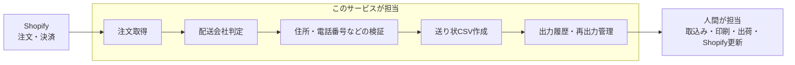
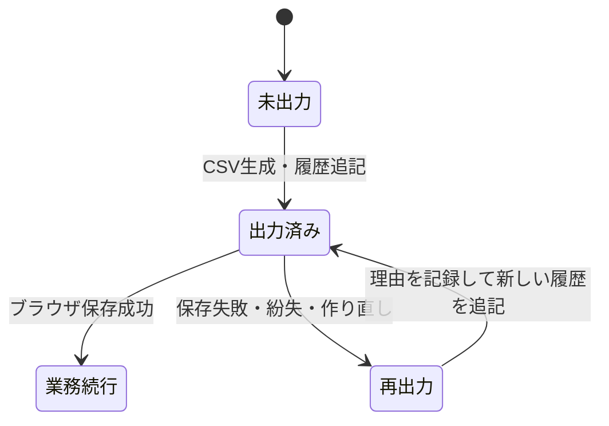

# ワコウ送り状CSV変換

Shopifyの注文を読み取り、株式会社ワコウ指定形式のヤマト（ネコポス）／佐川送り状CSVを作成する社内向けWebサービスです。

## これは何をするサービスなの？

### サービス説明

このサービスは、Shopifyの「決済済み・未発送・未キャンセル」の注文を取り込み、商品ごとの配送設定と数量から配送会社を判定し、送り状発行システムへ取り込むCSVを作成します。



このサービスが行うこと：

- Shopifyから対象注文を読み取る
- 商品／バリエーションの配送設定からヤマトまたは佐川を自動判定する
- 住所、郵便番号、電話番号、文字数、CSVで使用できる文字を検証する
- 担当者が配送会社を確認・変更できるようにする
- ヤマト42列、佐川50列の送り状CSVを作成する
- 出力履歴を保存し、同じ注文の重複出力を防ぐ
- 理由を記録したうえで出力済み注文を再出力する

このサービスが行わないこと：

- 佐川・ヤマトのシステムへのCSV取込み
- 送り状の印刷
- 梱包や実際の出荷
- 追跡番号の取得
- Shopifyの注文を「発送済み」に変更すること
- Shopifyへの追跡番号登録や購入者への発送通知

Shopifyへの権限は`read_orders`と`read_products`だけで、注文・商品・在庫・発送情報を書き換えません。CSVをダウンロードしてもShopify上の注文ステータスは変わりません。

#### 配送会社の判定ルール

Shopifyの商品またはバリエーションに、次のメタフィールドを設定します。バリエーション側の設定が商品側より優先されます。

| namespace | key | 型 | 値 |
|---|---|---|---|
| `delivery` | `carrier` | 1行のテキスト | `yamato`または`sagawa` |
| `delivery` | `yamato_max_quantity` | 整数 | 任意。ヤマトで送れる商品単位の最大数量 |

判定順序：

1. 配送会社未設定の商品を含む注文は「要確認」
2. 佐川の商品を1点でも含む注文は佐川
3. ヤマト商品のみでも、商品別または注文全体の数量上限を超えた場合は佐川
4. それ以外はヤマト
5. 担当者は自動判定にかかわらず、理由入力なしで最終的な配送会社を変更可能

商品設定の詳細は[`docs/shopify-setup.md`](docs/shopify-setup.md)を参照してください。

### 導入方法（クイックスタート）

本番ではMac miniにサービス、Shopify接続情報、出力履歴を集約し、担当者PCはブラウザだけを使用します。



必要なもの：

- Mac miniと、サービスを動かすmacOSユーザー
- Python 3.12以上
- [uv](https://docs.astral.sh/uv/)
- Git
- Shopifyカスタムアプリ
- 複数PCから利用する場合はTailscale

#### 1. ソースコードを準備する

```bash
mkdir -p "$HOME/Services"
cd "$HOME/Services"
git clone https://github.com/UNLegume/csv_transfer_for_wakou.git
cd csv_transfer_for_wakou
uv sync --extra dev
```

#### 2. Mac mini内に専用プロファイルを作る

他サービスとパス、ポート、ログ、出力履歴、LaunchAgentが重ならないよう、`production`プロファイルと専用ポート`8100`を作ります。

```bash
uv run wakou-macos-profile prepare \
  --profile production \
  --app-dir "$PWD" \
  --port 8100
```

設定ファイルは次の場所に作られます。

```text
~/Library/Application Support/WakouCSV/profiles/production/.env
```

ShopifyのClient ID／Secret、ログイン情報、発送元、ヤマト・佐川の契約情報は人間が入力します。秘密値をREADME、Git、チャット、作業ログへ記載しないでください。

`.env.example`の送り状固定値は提供サンプルの値です。請求コード、依頼主コード、便種、代引き種別、請求先分類コード、運賃管理番号などは、株式会社ワコウの正式回答を得てから設定してください。

#### 3. 設定を検証して起動する

```bash
uv run wakou-macos-profile validate --profile production
uv run wakou-macos-profile install --profile production
uv run wakou-macos-profile status --profile production
curl -fsS http://127.0.0.1:8100/api/health
```

正常時：

```text
launch_agent_loaded=true
health=true
{"status":"ok","service":"wakou-transfer"}
```

#### 4. 担当者PCから接続する

Mac miniでTailscale HTTPSを設定し、担当者には表示された専用URLだけを案内します。担当者PCにはPython、Git、アプリ本体、Shopifyの秘密情報を置きません。

Mac miniへの完全な導入手順、Tailscaleの既存設定との衝突確認、更新、停止、バックアップ、復元、AIエージェントが停止して人間へ確認する箇所は、[`docs/mac-mini-profile-deployment.md`](docs/mac-mini-profile-deployment.md)を参照してください。

## どうやって使うの？

### 出荷自体の全体のフロー

CSV作成は出荷作業の途中です。CSVをダウンロードしただけでは出荷完了ではなく、Shopifyのステータスも変わりません。



### どの部分のフローをこのサービスが賄っているか



| 作業 | 担当 |
|---|---|
| Shopify注文の読取り | このサービス |
| 配送会社の自動判定 | このサービス |
| 配送会社の最終確認・変更 | 人間が画面で確認 |
| 住所などの検証 | このサービス |
| Shopify上の住所修正 | 人間 |
| ヤマト／佐川CSV作成 | このサービス |
| CSVの配送会社システムへの取込み | 人間 |
| 送り状印刷・梱包・出荷 | 人間 |
| 追跡番号の確認 | 人間 |
| Shopifyを発送済みに変更 | 人間 |
| Shopifyへ追跡番号を登録 | 人間 |

### 具体的な利用方法

#### 通常のCSV出力

1. 管理者から案内されたHTTPS URLをブラウザで開き、案内されたユーザー名とパスワードでログインします。
2. `注文日（開始）`、`注文日（終了）`、`出荷予定日`を入力します。
3. `Shopifyから注文取得`を押します。
4. `自動判定`、`出力先`、`検証状態`を確認します。
   - 配送会社が未設定なら、`出力先`でヤマトまたは佐川を選択します。
   - 自動判定と異なる配送会社へ変更しても構いません。指定・変更理由は不要です。
   - 住所などのエラーはShopify側で修正し、注文を再取得します。
5. 出力する注文のチェックボックスを選択します。`ヤマト候補を選択`、`佐川候補を選択`も利用できます。
6. `ヤマトCSVをダウンロード`または`佐川CSVをダウンロード`を押します。
   - ヤマトと佐川を混在選択できます。
   - 一方を出力した後も、もう一方の未出力選択は維持されます。
7. ダウンロードしたCSVを、担当者が配送会社のシステムへ取り込みます。

```text
┌──────────────────────────────────────────────────────────────┐
│ 注文日（開始）  注文日（終了）  出荷予定日  [Shopifyから注文取得] │
├──────────────────────────────────────────────────────────────┤
│ 対象注文       ヤマト候補       佐川候補       要確認・エラー     │
├──────────────────────────────────────────────────────────────┤
│ [未出力の注文] [出力済み一覧]                                  │
├──────────────────────────────────────────────────────────────┤
│ [ヤマト候補を選択] [佐川候補を選択] [選択解除]   〇件選択        │
│                         [ヤマトCSV] [佐川CSV]                  │
├──────────────────────────────────────────────────────────────┤
│ □ 注文番号 │ 配送先 │ 商品 │ 自動判定 │ 出力先 │ 検証状態       │
└──────────────────────────────────────────────────────────────┘
```

#### 出力済みになるタイミング

CSVがMac mini上で生成され、出力履歴へ記録された時点で`出力済み`になります。ブラウザへの保存に失敗した場合も出力済みとして扱われるため、通常出力を繰り返さず、出力済み一覧から再出力します。



#### ダウンロードに失敗した場合・再出力する場合

1. 対象注文を含む期間を指定して、`Shopifyから注文取得`を押します。
2. `出力済み一覧`タブを開きます。
3. 注文番号で検索するか、`さらに表示`で対象注文を探します。
4. 再出力先を確認し、`再出力理由（必須）`を入力します。
5. `再出力`を押してCSVを保存します。

再出力では以前の履歴を変更せず、新しい履歴を追記します。配送会社の初回指定・通常変更には理由は不要ですが、再出力理由だけは重複取込み防止のため必須です。

#### 利用上の注意

- CSVには氏名、住所、電話番号が含まれます。メールや許可されていないチャットへ添付しないでください。
- ダウンロードしたCSVを共有PCやダウンロードフォルダへ放置せず、社内ルールに従って削除してください。
- 出力済み注文を、履歴を確認せず通常出力し直さないでください。
- 住所エラーはCSV上で場当たり的に直さず、Shopifyの正本を修正して再取得してください。
- Mac miniの設定ファイル、出力履歴データ、動作記録を担当者PCへコピーしないでください。

### 機能早見表

| 機能 | できること | 備考 |
|---|---|---|
| Shopify注文取得 | 決済済み・未発送・未キャンセル注文を期間指定で取得 | 読取り専用 |
| 配送会社自動判定 | 商品設定と数量からヤマト／佐川を候補表示 | 最終判断は担当者 |
| 配送会社の手動指定 | 未設定注文の指定、自動判定からの変更 | 理由入力不要 |
| 宛先検証 | 氏名、住所、郵便番号、電話番号、文字数、CSV文字を確認 | エラーはShopify側で修正 |
| 複数注文選択 | 候補別一括選択、ヤマト・佐川の混在選択 | 配送会社別にCSV出力 |
| ヤマトCSV | ワコウ指定42列、ネコポス向け | CP932・CRLF |
| 佐川CSV | ワコウ指定50列 | CP932・CRLF |
| 出力履歴 | 注文番号、配送会社、生成日時などを保存 | 氏名・住所・電話番号は保存しない |
| 重複出力防止 | 出力済み注文を未出力一覧から除外 | CSV生成・履歴追記時点で出力済み |
| 履歴検索 | 注文番号検索、100件単位の追加表示 | 古い履歴にも到達可能 |
| 再出力 | 出力済み一覧からCSVを再生成 | 再出力理由が必須、履歴は追記 |
| Shopifyステータス更新 | 対応しない | 出荷後に人間が発送済み・追跡番号を登録 |
| 配送会社への自動送信 | 対応しない | 人間がCSVを取り込む |

## シートにどういう情報が載っているの？

ダウンロードされるものはExcelファイルではなくCSVです。先頭行が項目名で、2行目以降は1注文につき1行です。

| 共通仕様 | 内容 |
|---|---|
| 文字コード | CP932 |
| 改行 | CRLF |
| 区切り | カンマ |
| 見出し | あり |
| 行単位 | 1注文1行 |
| 個人情報 | 届け先氏名、住所、郵便番号、電話番号を含む |
| 商品明細 | Shopifyの商品名やSKUの一覧は出力しない |

先頭ゼロを失わないよう、電話番号、郵便番号、請求コード、依頼主コードなどは文字列として出力します。設定値が未確定の列は、本番利用前に株式会社ワコウの正式値を確認してください。

### ヤマト

ヤマトCSVは42列です。主に次の情報が入ります。

| 情報 | CSV上の主な項目 | 内容・取得元 |
|---|---|---|
| 注文番号 | `お客様管理番号` | Shopify注文番号。先頭の`#`は除去 |
| 送り状設定 | `送り状種別` | Mac miniのヤマト設定値 |
| 出荷日 | `出荷予定日` | 画面で指定した出荷予定日 |
| 届け先電話番号 | `届け先電話番号` | Shopify配送先電話番号 |
| 届け先郵便番号 | `届け先郵便番号` | Shopify配送先郵便番号 |
| 届け先住所 | `届け先住所` | Shopify配送先住所1 |
| 建物名 | `届け先建物名（アパートマンション名）` | Shopify配送先住所2 |
| 届け先名 | `届け先名（漢字）` | Shopify配送先氏名 |
| 依頼主契約情報 | `依頼主コード` | Mac miniに設定したヤマト依頼主コード |
| 依頼主情報 | `CM：ご依頼主電話番号`、`CM：ご依頼主郵便番号`、`CM：ご依頼主住所`、`CM：ご依頼主名称１` | Mac miniに設定した発送元情報 |
| 品名 | `C：品名 購入品` | 固定設定値。標準は「ネットショップ購入品」 |
| 代引き金額 | `コレクト代金引換額（税込）`、`コレクト内消費税額` | Mac miniのヤマト設定値 |
| 請求情報 | `請求先分類コード`、`運賃管理番号` | Mac miniのヤマト設定値。未設定なら空欄 |

現在空欄で出力する主な項目：

- 温度区分、配達指定日、時間指定コード、届け先コード
- 届け先名カナ、敬称、会社・部門名
- 品名コード、荷扱い、営業所止置き
- ネコポス発行枚数、ネコポス個数口枠の印字
- 予備列、空欄指定列

**Shopifyの商品名やSKUはヤマトCSVへ出力せず、品名には固定設定値を使用します。**

### 佐川

佐川CSVは50列です。主に次の情報が入ります。

| 情報 | CSV上の主な項目 | 内容・取得元 |
|---|---|---|
| 注文番号 | `伝票no` | Shopify注文番号。先頭の`#`は除去 |
| 金額設定 | `合計金額`、`合計金額（単位）` | Mac miniの佐川設定値 |
| 日付 | `shitei_bi_a`、`shitei_bi_b`、`shitei_bi_c` | 日付出力を有効にした場合、画面で指定した出荷予定日 |
| 配送設定 | `便種` | Mac miniの佐川設定値 |
| 受注者情報 | `受注名`、`受注郵便番号`、`受注者住所`、`受注者電話番号` | Shopify請求先。請求先がなければ配送先 |
| 届け先情報 | `お届け先名`、`お届け先郵便番号`、`お届け先住所`、`お届け先電話` | Shopify配送先情報 |
| 指示文言 | `option1`〜`option6` | Mac miniの佐川設定値 |
| 出荷元情報 | `C：出荷元企業名`、`C：出荷元郵便番号`、`C：出荷元住所`、`C:出荷元電話番号` | Mac miniに設定した発送元情報 |
| 依頼主情報 | `CM：ご依頼主電話番号`、`CM：ご依頼主郵便番号`、`CM：ご依頼主住所１`、`CM：ご依頼主名称１` | Mac miniに設定した発送元情報 |
| 支払い設定 | `郵便種別`、`元／着払い種別`、`代引き種別` | Mac miniの佐川設定値 |
| 契約情報 | `請求コード` | Mac miniに設定した佐川請求コード |

現在空欄で出力する主な項目：

- 受注no、時間指定
- 佐川シールコード1〜4
- 営業所止め、営業所名
- 発送備考欄
- 取扱商品、品名1〜5、依頼品欄
- ヤマト専用列

**Shopifyの商品名やSKUは佐川CSVの品名欄へ出力せず、現在は空欄です。**

CSVの正式な列順、空欄列、固定値は株式会社ワコウ提供サンプルと一致するよう実装しています。CSV形式を変更する場合は、ワコウ側システムへの試験取込みを行ってください。

### 開発時の確認

```bash
uv sync --extra dev
uv run playwright install chromium
uv run pytest
uv run ruff check .
uv run mypy src tests
```

テストはShopify GraphQL、配送判定、宛先検証、CSV列契約、Web API、画面操作、混在選択、履歴、再出力、二重送信防止、Mac miniプロファイル運用を対象にしています。
